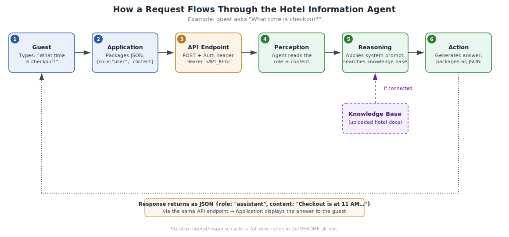

# Hotel Information Agent

[](https://ai.azure.com/)
[]()
[](#license)

An AI-powered concierge agent that answers hotel guests' questions in real time — amenities, dining, checkout, and more — grounded in the hotel's own policy and reference documents rather than guessing. Built on Azure AI Foundry as a hands-on project in Microsoft's *AI Agent Fundamentals* course, and extended here with the testing, documentation, and deployment practices needed to take an agent from a Playground demo to something production-shaped.

## Features

- **Amenities inquiry** — answers guest questions about hotel amenities (pool hours, WiFi, spa, pet policy, and similar).
- **Restaurant information** — provides restaurant hours and dining options.
- **Check-out assistance** — responds to questions about check-out times and procedures, including late-checkout requests.
- **Grounded, cited answers** — responses are sourced from the hotel's uploaded knowledge base rather than generated from memory, reducing hallucinated policy details.
- **Graceful fallback** — when a question falls outside its knowledge base (pricing, group discounts, emergencies), the agent says so plainly and refers the guest to hotel staff instead of guessing.

See [`docs/user-stories.md`](docs/user-stories.md) for ten worked examples of these capabilities in realistic guest scenarios, and [`docs/user-story-test-cases.md`](docs/user-story-test-cases.md) for the test cases that verify each one.

## Architecture and Technologies

- **Platform:** [Azure AI Foundry](https://ai.azure.com/)
- **AI Model:** GPT-5-mini
- **Configuration:** Temperature and Top-p set to `0.5` as a starting point (see [`docs/step3-technical-documentation.md`](docs/step3-technical-documentation.md) for the full configuration guide and what each parameter controls)
- **System Instructions:**
  > "You are a helpful hotel concierge attending to guest inquiries and concerns. Be polite, accommodating, and maintain a great attitude with every guest."
- **Knowledge base:** hotel policy, amenities, and dining documents, searched before every response and cited as `[Source: filename]`

### How a request flows through the agent



The agent follows a **perception → reasoning → action** cycle on every turn: it reads the incoming message (perception), applies its system instructions and searches the knowledge base if needed (reasoning), then generates and returns a response (action). Full request/response detail, including the JSON message format and authentication, is documented in [`docs/under-the-hood-documentation.md`](docs/under-the-hood-documentation.md).

### System architecture


## Getting Started

### Prerequisites

- Python 3.10+
- An Azure AI Foundry project with this agent deployed
- Azure credentials available locally (e.g. via `az login`) for `DefaultAzureCredential`

### Installation

```bash
git clone https://github.com/<your-username>/Hotel-Information-Agent.git
cd Hotel-Information-Agent
pip install azure-ai-projects azure-identity
```

### Configuration

Set your project connection string and agent ID as environment variables rather than editing the code:

```bash
export PROJECT_CONNECTION_STRING="<your-region>.api.azureml.ms;<subscription-id>;<resource-group>;<project-name>"
export AGENT_ID="<your-agent-id>"
```

### Usage

```bash
python src/agent.py
```

Example interaction:

```
Guest asked: What time is checkout?
Agent replied: Check-out is at 11 AM. Would you like to request a late checkout?
```

To ask a different question, call `ask_agent("your question here")` from `src/agent.py` directly, or wire it into your own application via the same function.

## Documentation

| File | Contents |
|---|---|
| [`docs/under-the-hood-documentation.md`](docs/under-the-hood-documentation.md) | API endpoint, JSON message format, perception-reasoning-action cycle, authentication |
| [`docs/step3-technical-documentation.md`](docs/step3-technical-documentation.md) | API operation reference, sample request/response, configuration parameter guide |
| [`docs/user-stories.md`](docs/user-stories.md) | Ten real-world guest scenarios the agent is designed to handle |
| [`docs/user-story-test-cases.md`](docs/user-story-test-cases.md) | Traceable test case for each user story |
| [`docs/lessons-learned.md`](docs/lessons-learned.md) | Reflection on building and documenting this project |

## Testing & Quality Assurance

This project treats testing as a first-class part of agent development, not an afterthought:

- **15 test scenarios** spanning normal/expected, edge case, and security categories (`AI_Agent_Test_Plan_Template.docx`, `Example Test Cases.docx`)
- **A findings & recommendations pass** (`Step4_Findings_and_Recommendations.docx`) that prioritized fixes by impact/urgency — e.g. consolidating an inconsistent WiFi knowledge-base entry, and adding a fallback instruction so emergency queries (like a lost passport) are escalated to staff instead of answered vaguely
- **10 user-story-driven test cases** (`docs/user-story-test-cases.md`) verifying real-world scenarios end to end, following a consistent test case template (purpose, input, expected output, pass/fail criteria)

## Demonstration

*Coming soon — a ~2-minute captioned walkthrough showing the agent handling an easy question (e.g. restaurant hours), a more complex multi-part question, and a question outside its scope (to demonstrate its safety boundaries), followed by a quick tour of this repo.*

## Lessons Learned

- **Prompt engineering** — gained practical experience crafting and refining prompts, including adding explicit boundary and fallback instructions rather than relying on the model's default judgment.
- **Agent boundaries** — implemented system guardrails to keep the agent focused on concierge-related tasks and to escalate rather than guess on emergencies, pricing, or other out-of-scope requests.
- **Documenting without exposing secrets** — learned to write architecture and API documentation using clearly-marked placeholders for endpoints/keys, so the project stays copy-pasteable without ever risking a real credential landing in version control.
- **UI/Accessibility** — learned how to optimize keyboard navigation (e.g. using Tab to move to the next interactive element on the page).

See [`docs/lessons-learned.md`](docs/lessons-learned.md) for the full reflection, including specific challenges and what I'd do differently next time.

## Project Structure

```
Hotel-Information-Agent/
├── src/
│   └── agent.py                          # Client script for the deployed agent
├── docs/
│   ├── under-the-hood-documentation.md
│   ├── step3-technical-documentation.md
│   ├── agent-architecture-diagram.png / .svg
│   ├── step3-architecture-diagram.png / .svg
│   ├── user-stories.md
│   ├── user-story-test-cases.md
│   └── lessons-learned.md
├── tests/
│   ├── AI_Agent_Test_Plan_Template.docx
│   ├── Example Test Cases.docx
│   └── Step4_Findings_and_Recommendations.docx
└── README.md
```

## Contributing

This is currently a solo learning project, but suggestions and issues are welcome — open an issue describing the change you'd like to see, or fork the repo and submit a pull request.

## License

[MIT](LICENSE) — feel free to use this as a reference for your own agent projects.
